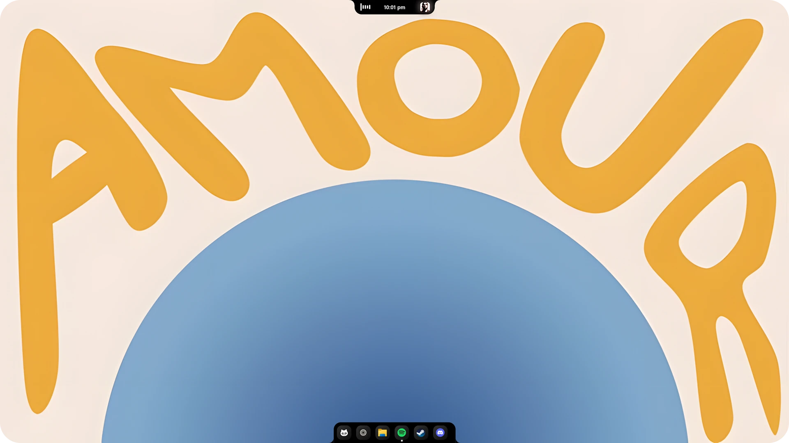

<div align="center">


# Nectar

</div>

---

Nectar makes your Windows desktop feel alive: a macOS-style notch/island at the top of your screen and a dock that replaces your taskbar, both physics-animated and reactive.

**Nectar is a fork of [Bloom](https://github.com/SehajveerSingh2005/bloom) by Sehajveer Singh** — full credit to the original project for the concept and the implementation this is built on. In one sentence: Nectar is the same idea under new ownership, rebranded end-to-end and maintained independently, with its own fixes, changes, and direction going forward.

---

<div align="center">

<br/><br/>

</div>

---

## The Island

A notch at the top of your screen that adapts to what you're doing. Scroll or swipe to switch modes, or set it to stay fixed like a real hardware notch.

- **Music** — album art, track info, playback controls, and a visualizer that reacts to five frequency bands with spring physics.
- **Command Center** — WiFi, Bluetooth, Do Not Disturb, volume, brightness — the stuff you usually dig through Windows settings for.
- **Status** — battery (auto-hidden on desktops with no battery) and weather, with a configurable widget layout.
- **Calendar** — a month view with a Pomodoro timer built in.

Each transition is spring-loaded — width, height, border-radius, and position all animate independently. In **smart**/**peek** mode the notch still reveals and stays fully clickable over a fullscreen app; only a thin strip right at the screen edge stays click-through, so it never steals input meant for whatever else you're running (a screenshot tool, a game).

## The Dock

A taskbar that actually moves. Nectar replaces your native Windows taskbar and sits at the bottom of the screen: drag to reorder, hover for window previews, right-click for context menus. A Start-adjacent search icon opens Windows Search directly.

Pinned and running apps stay in two separate groups by default, with a divider marking the split — flip "Mix Pinned & Running" in Settings to drag any icon anywhere instead.

## Under the Hood

A Rust backend that talks directly to the Windows shell — global input hooks, WASAPI for real-time system audio capture, COM for media session control, WMI for hardware monitoring. Idle work (the audio visualizer, cursor tracking, thumbnail capture) pauses itself when there's nothing to react to.

Every setting lives in a plain `settings.json` you can edit or script directly — see [SETTINGS.md](SETTINGS.md) for the full reference. Settings > About also has a real "Reset to Defaults" that actually resets everything, not just the ones that happen to not be cached.

---

## Get It Running

**Download** the latest build from [Releases](https://github.com/kua8/Nectar/releases/latest). The installer asks whether to install for just you or all users — pick either.

Or build from source:

```bash
git clone https://github.com/kua8/Nectar.git
cd Nectar
bun install
bun run tauri dev
```

You'll need [Rust](https://rustup.rs/) and [Bun](https://bun.sh/).

---

## Microsoft Defender

Unsigned, low-download-count Windows apps built by independent developers commonly trigger a Defender warning purely on reputation heuristics, not because anything was actually found. If Nectar gets flagged and you'd rather not wait it out, you can submit the file to Microsoft for analysis yourself, or build from source instead of using a prebuilt binary.

## Contributing

Nectar is open source under [GPLv3](LICENSE). Found a bug or have an idea? Open an issue or send a PR.
